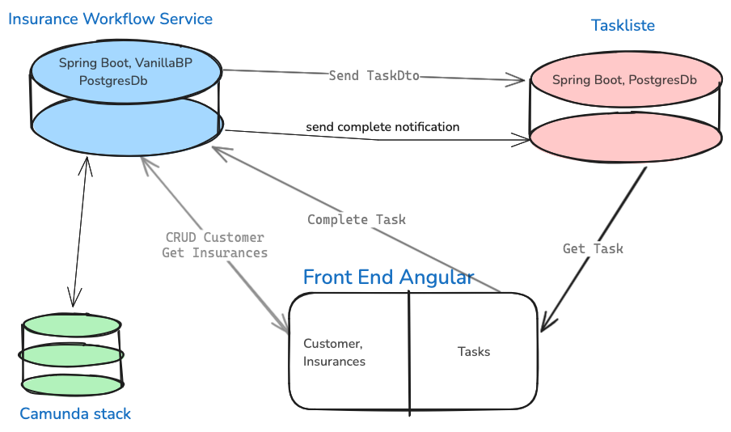
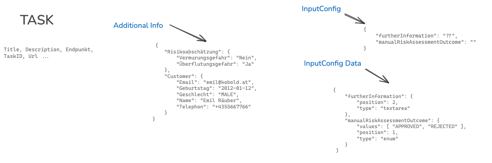

## Insurance Showcase

A frontend with a task list and process visualisation on top of a backend built with VanillaBP and Camunda8, showing a process of insurance application for agents.



### Firstly:

You need do start the Camunda8 stack:
```bash
git clone https://github.com/camunda/camunda-platform.git 
cd camunda-platform
docker-compose up -d
```

clone the repo
```bash
git clone https://github.com/Phactum/insurance-showcase.git  
cd insurance-showcase  
docker-compose up -d
```

Now you have 3 applications:

- ***workflow*** for the process engine. Spring Boot with VanillaBP, PostgresDB
- ***tasklist*** for the task list, this persists the user tasks. Spring Boot, PSQL
- ***frontend*** Angular application, communicates with the two backend applications

Build workflow and tasklist with ***mvn compile*** or ***mvn package***
and start e.g. with ***mvn spring-boot:run*** or run it with your favorite IDE.

```bash

```

build the frontend with ***npm install*** and then start it with ***ng serve***

### A UserTask is configured as follows:

```java
public class TaskDto {
    // the common fields which every task has like taskID and so on
    // and here the special fields
    String additionalInfo;
    String inputConfig;
    String inputConfigData;
}
```

The fields additionalInfo, inputConfig and inputConfigData contain Json objects that contain task-specific information and are configured in the workflow service.
A Customer map and a RiskAssessment map is most recommended for this:

Customer:

```java
public class WorkflowService {
    public void createAdditionalInfoMap() {
        SortedMap<String, SortedMap<String, String>> additionalInfoMap = new TreeMap<>();

        SortedMap<String, String> customerMap = new TreeMap<>();

        // Customer

        customerMap.put("Name", "Kim Gordon");
        customerMap.put("Email", "kim@sonic-youth.at");
        customerMap.put("Telephone", "+43 670 123 123");
        customerMap.put("Date of birth", "28-04-1953");
        customerMap.put("Gender", "FEMALE");
        additionalInfoMap.put("customer", customerMap);

        // RiskAssessment

        SortedMap<String, String> riskAssessment = new TreeMap<>();
        riskAssessment.put("Danger of mudslides", "Yes");
        riskAssessment.put("Danger of flooding", "Yes");
        additionalInfoMap.put("Risk Assessment", riskAssessment);

        TaskDto taskDto = new TaskDto();
        taskDto.setAdditionalInfo(OBJECT_MAPPER.writeValueAsString(additionalInfoMap));
    }
}
```
The inputConfig and inputConfigData fields are used to configure the task-specific input fields. Sometimes you need a text field, other times a check or select box. InputConfig says which fields are needed, inputConfigData contains default values and the position in which they should be arranged in the frontend.

```java
public class WorkflowService {
    public void createInputConfig() {

        // Which fields are needed:

        Map<String, Object> inputConfig = new HashMap<>();
        inputConfig.put("furtherInformation", "");
        inputConfig.put("riskAssessmentOutcome", "");

        // Define input type and default values

        Map<String, Object> configData = new HashMap<>();
        Map<String, Object> approveRejectSelectBox = new HashMap<>();

        approveRejectSelectBox.put("position", 1);
        approveRejectSelectBox.put("type", "select");
        approveRejectSelectBox.put("values", new String[] {"APPROVED", "REJECTED"});
        configData.put("riskAssessmentOutcome", approveRejectSelectBox);

        Map<String, Object> riskDescription = new HashMap<>();
        riskDescription.put("position", 2);
        riskDescription.put("type", "textarea");

        configData.put("furtherInformation", riskDescription);

        TaskDto taskDto = new TaskDto();
        taskDto.setInputConfig(OBJECT_MAPPER.writeValueAsString(inputConfig));
        taskDto.setInputConfigData(OBJECT_MAPPER.writeValueAsString(inputConfigData));

    }
}
```

A finished TaskDto is sent to the task list application and persisted there. In the frontend, the objects are iterated through and displayed generically; the task list only specifies the format it needs for this.



